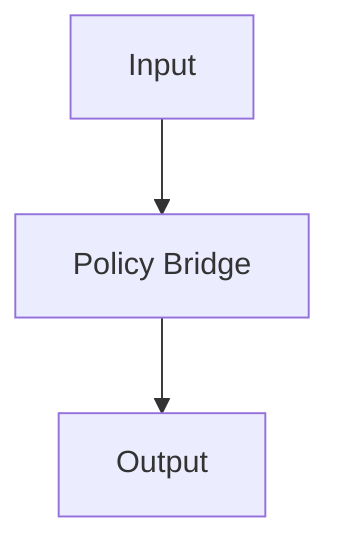

# System Design

## System Architecture

## Features
- Loads the `onnx` policy
- create config for devices (e.g, CUDA, MPS, TensorRT)

## API

- load: loads the onnx RL policy
- info: logs the info of the loaded RL policy
